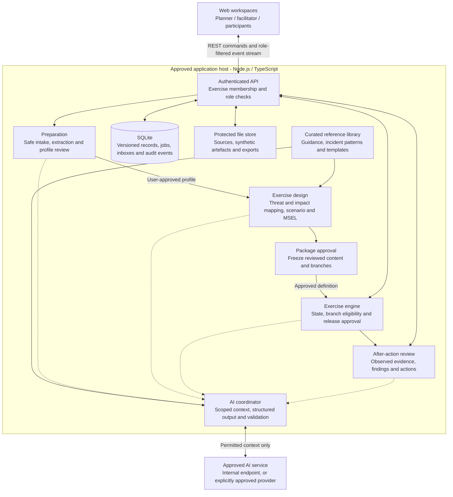
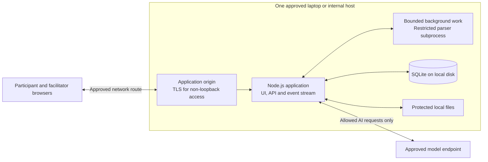

# AI Assisted Technical TTX Platform Architecture

## Baseline integration — 15 September 2026

This remains the canonical architecture document. All application components below are planned, not implemented. Only the documentation/configuration baseline exists; no runtime controls have been tested.

Use [PROJECT](PROJECT.md) for working requirements and environment constraints, [DECISIONS](DECISIONS.md) for accepted versus proposed choices, [QUALITY](QUALITY.md) for verification criteria and [WORK](WORK.md) for actual state. Historical research and technology recommendations below do not establish current approval or installation.

The first slice uses a synthetic profile and prepared inject. Build only the profile/definition, approval/release, participant projection, response and durable activity boundaries it needs. Intake workers, AI coordination, retrieval and reporting come later; no speculative module directories are needed now.

### Shared contract and release design

During scaffolding, define executable schemas once in an application-owned contracts module. UI, API, persistence mapping and future AI parsing consume or derive from that source. Section 6 is a conceptual inventory, not an executable schema.

Specify stable IDs and immutable profile/definition/inject revisions; run and membership references; allowlisted participant payloads; approval actor, content hash/revision, recipients and expected run revision; release idempotency keys; response author/team and released-inject reference; ordered event IDs and timestamps. Validate references as well as fields, and represent unknown values explicitly.

Release checks authority, run state, definition membership, eligibility, content revision and recipients in the authoritative transaction. Approval, release, inbox and activity changes commit consistently. A repeated successful idempotency key returns its existing result; reuse with different content fails. Concurrent requests check expected run revision. Participant projections exclude private material server-side. Restarted interrupted runs remain paused until explicitly resumed.

### Two-person implementation boundary — 15 September 2026

Planning direction: user owns the backend, teammate owns the frontend. Retain one application and repository. The proposed stack remains subject to ADR-006; this section does not establish installed software.

| Owner | Responsibilities | Suggested locations once needed |
| --- | --- | --- |
| Backend / user | HTTP API, identity and membership checks, application rules, SQLite persistence, activity, AI jobs and provider adapter, integration tests | `src/server/`, `src/server/adapters/`, `tests/server/` |
| Frontend / teammate | Profile review, facilitator and participant views, API client, loading/error states, accessible interactions and UI checks | `src/ui/`, `tests/ui/` |
| Shared; backend coordinates | Executable request/response schemas, generated types/API description where practical, synthetic response examples, error codes and contract changes | `src/contracts/`, `tests/fixtures/` |

These paths are a proposed minimal layout, not directories to create in advance. Backend-only profile evidence and facilitator records must not be bundled into participant-facing types or payloads. Share contracts, not server implementation or secrets.

Both developers use separate Git checkouts/branches and local test data. Integrate one behaviour at a time; do not edit the same OneDrive working directory from two machines. One owner coordinates root package configuration and lockfile changes. Review interface changes together before implementing incompatible fields. Frontend mocks use the same reviewed synthetic examples and schemas as backend checks; mocks are not evidence that permissions or persistence work. Run a real browser-to-server check at every checkpoint.

### Proposed browser API handoff

Agree field-level contracts during TASK-001A. The following routes are a design sketch, not implemented endpoints. The frontend talks only to the TTX API. The server derives the actor from its session; request bodies cannot select authority.

| Checkpoint | Route sketch | Contract purpose |
| --- | --- | --- |
| Profile | `GET /api/me` | Current demonstration identity and permitted exercise memberships |
| Profile | `GET /api/profiles/:profileId/revisions/:revisionId` | Authorised profile review projection with explicit unknowns |
| Profile | `POST /api/profile-confirmations` | Confirm an exact profile revision; return durable confirmation |
| Release | `POST /api/runs/:runId/approvals` | Approve exact reviewed inject revision and recipients against expected run revision |
| Release | `POST /api/runs/:runId/releases` | Release with approval reference, expected run revision and idempotency key |
| Participant | `GET /api/runs/:runId/inbox` | Only releases accessible to the authenticated participant |
| Participant | `POST /api/runs/:runId/responses` | Record agreed response referencing an accessible release |
| Activity | `GET /api/runs/:runId/activity` | Facilitator activity projection with ordered event IDs and pagination |
| AI experiment | `POST /api/ai/inject-proposals` | Facilitator starts a bounded job referencing a confirmed profile and reviewed objective |
| AI experiment | `GET /api/ai/jobs/:jobId` | Authorised job status and, on validated success, a draft proposal reference |

Use a consistent safe error envelope with a stable code, user-facing message and optional field errors. Specify unauthenticated, forbidden, validation and stale-revision conflicts in contracts. Duplicate release retries with the same payload return the original result; key reuse for different content is a conflict. List/read routes for reviewing definitions and approvals, and lifecycle commands, must be specified in their checkpoint before their screens depend on them. This is not the complete MVP API.

### Proposed Codex adapter experiment

Intended flow: facilitator UI -> TTX API -> bounded AI job -> backend Codex adapter -> validated draft -> facilitator review. The existing approval/release transaction remains the only path to participant inbox availability. A Codex tool approval is never a TTX release approval.

Official protocol basis, checked 15 September 2026: `codex app-server` supports stdio. Complete `initialize` / `initialized`, inspect `account/read`, and use managed `account/login/start` with `type: chatgpt` when needed. Start a thread and `turn/start` with an application-owned `outputSchema`. Collect final output and check the terminal `turn/completed` status; it can indicate failure or interruption. Pin the CLI and generate matching protocol types. The documentation labels app-server experimental and unsupported for production workloads. [Official app-server documentation](https://learn.chatgpt.com/docs/app-server)

Subscription sign-in and API-key billing are separate access modes; an unavailable subscription must not silently fall back to paid API usage. [Official authentication documentation](https://learn.chatgpt.com/docs/auth)

Application design to prove in the experiment:

- Backend supervises one local process through private pipes, with bounded message sizes, correlated request IDs, timeouts, cancellation and exit handling. Windows executable resolution and process cleanup require testing.
- Operator signs in locally through the managed flow. Keep credentials and provider history outside source control/OneDrive; teammate develops against a fake adapter or independently authorised account. Do not copy account tokens or expose Codex's general protocol to the browser.
- Use an isolated runtime configuration and working directory, not the development repository or live database directory. Audit inherited instructions, plugins, hooks and MCP configuration. Enforce no model access to shell execution, application storage, credentials or delivery tools. A prompt saying "do not use tools", a read-only filesystem setting, or declining approval requests alone does not prove this boundary. Verify supported restrictions on the selected Windows build before connecting participant-supplied text; fail the experiment if the required isolation cannot be enforced.
- Supply only the selected synthetic profile snapshot, objective and allowed roles/assets. Start fresh context per independent generation job. Store request/profile/contract/prompt/model versions and the resulting draft provenance without logging secrets.
- Treat model output as untrusted data. Validate schema, references, bounds and profile revision; preserve unknowns; reject unsupported references. Human review still assesses plausibility and factual support.
- Persist an application job before requesting generation. Return `202` with a job ID; frontend polls initially. Proposed statuses: queued, running, succeeded, failed, cancelled. Success means a validated draft was stored, never approved or released. Show safe failure codes for rate limits, sign-in required, invalid output and provider unavailability.
- Bound concurrency to one generation for the initial experiment. Prevent accidental duplicate jobs, discard late results after cancellation and mark interrupted jobs explicitly on restart. Do not automatically replay uncertain provider requests. Manual play continues in every failure case.

---

Status: proposed design for review, 9 September 2026. No platform implementation has started.

Recommendation: a web-first, single-organisation prototype with a Node.js/TypeScript modular backend. AI assists preparation and interpretation. Application rules and recorded human approvals control what becomes an organisational fact, an exercise definition, a delivered inject, or a final finding.

## 1. Architecture diagram



The preparation chain shows the lifecycle. API-to-storage edges summarise persistence through the application modules, not browser access to the database. Dashed edges represent bounded AI calls and their validated results, not permission to advance an exercise. The browser receives only its authorised view of records.

The model has no delivery credentials, database access, shell, production-system connection or approval authority. AI unavailability must not prevent manual execution of an already approved package.

## 2. Requirements baseline

The supplied Form B is the primary working baseline, supported by the SME-focused slide content and research guide. This design does not establish that the proposal or technology choices have received formal supervisor approval.

| Project requirement | Architectural response |
| --- | --- |
| One representative SME and one technical scenario | One organisation per deployment and one active run for the MVP |
| One agreed diagram format, optional text-based BCP/BIA/DRP and guided questions | Format-specific parsers feeding a common source and candidate-fact model |
| Assets, connections, services, roles, suppliers, RTO/RPO and exclusions | Versioned organisation profile with typed relationships and source references |
| Missing information, conflicts, assumptions and user confirmation | Reconciliation workspace and explicit profile approval |
| 10-15 MSEL entries, 3-4 functional roles, three decision points | Bounded scenario definition with approved alternatives and a shared main storyline |
| Web delivery and agreed participant decisions | Role-specific inboxes plus actions, rationale and information-request submissions |
| Approve, edit, reject, override, pause and manual continuation | Server-enforced state transitions and approval records independent of the model |
| Draft AAR and improvement actions | Report generation from a fixed exercise-record snapshot with evidence references |
| Controlled evaluation and school-safe demonstration | Synthetic reference pack, independent human labels, control tests and sanitised exports |

Sources: [Form B](../GPT_ICT4011_Form_B_AI_Assisted_TTX.docx), [supervisor slides](../supervisor_AI%20TTX%20Idea.pptx), [research guide](../capstone_ttx_reference/AI_TTX_Research_Guide.md).

Scope exclusions remain intact: no cyber range, exploit execution, malware deployment, production-system changes, autonomous attack activity, certification, proof of real recovery performance, production multi-tenancy, high availability or enterprise SSO. A scenario pathway is a reviewed hypothetical incident narrative, not a verified route into a real network.

### Source inconsistencies

- Some slide notes retain older CIIO/CCoP framing. Use the SME/Cyber Trust framing in Form B and the slide bodies. Do not import CII obligations or assume a Cyber Trust tier.
- Slide 6 mentions Slack discussion, while Form B and slide 7 specify a web interface. The MVP records agreed decisions in the web application. Slack/Discord integration and a participant chatbot are deferred.
- The research guide describes the local ENISA PDF as a 56-page extract. The actual file inspected has 72 PDF pages. Treat the guide's inventory as historical rather than authoritative file metadata.
- Existing AI assistance and adaptive delivery are prior art. The comparison below refines earlier platform claims without editing the supplied reference materials.

## 3. Comparison and reuse decision

T3SF was downloaded for read-only source inspection. The reviewed `main` snapshot is commit `182ddc9b7bf804e93bbfe9d3f2112d8c20f7fec6`, dated 30 October 2023. Inspection covered the README, changelog, core orchestration, GUI handlers and example MSEL. It was not installed or executed. INJECT was reviewed through official documentation on 9 September 2026, without deployment testing.

| Dimension | T3SF evidence | INJECT evidence | Capstone proposal |
| --- | --- | --- | --- |
| Delivery | JSON MSEL, timed orchestration, Slack/Discord adapters and polls | Web views and conditional milestone progression | Native web inboxes and one authoritative exercise state |
| Authoring | MSEL editing and example event/scenario content | Definitions with roles, objectives, inject alternatives and questionnaires | Draft an exercise from an approved SME profile, then review it |
| AI | Changelog documents a database of AI-generated events | Definitions describe email/free-form LLM assessment; the LLM page focuses on sandbox hints | Grounded drafting and interpretation with approved follow-ups |
| Control | Pause/resume/stop controls | Instructor interaction and conditional progression | Package approval plus separate approval for every release |
| Technology | Python orchestration and Flask GUI in inspected source | Go backend, React/TypeScript frontend, GraphQL and REST; Linux/Docker Compose installation | Node.js/TypeScript backend, React frontend and local persistence |
| Reuse | Repository identifies GPL-3.0 | Official license page identifies MIT | Review actual component and content licenses before copying |

Evidence: [T3SF README](https://github.com/Base4Security/T3SF/tree/182ddc9b7bf804e93bbfe9d3f2112d8c20f7fec6), [changelog](https://github.com/Base4Security/T3SF/blob/182ddc9b7bf804e93bbfe9d3f2112d8c20f7fec6/CHANGELOG.md), [INJECT architecture](https://docs.inject.muni.cz/tech/architecture/overview/), [installation](https://docs.inject.muni.cz/tech/installation/overview/), [definitions](https://docs.inject.muni.cz/tech/architecture/definitions/), [milestone logic](https://docs.inject.muni.cz/INJECT_process/specify/milestone_logic/), [LLM integration](https://docs.inject.muni.cz/tech/llm-integration/), [license](https://docs.inject.muni.cz/license/).

Do not describe T3SF as having no AI, or infer project-wide abandonment solely from the reviewed commit date. INJECT documents assessment-related definition fields and corresponding [evaluation log records](https://docs.inject.muni.cz/tech/log-format/), but their behaviour in a specific release was not verified. The hints page is not evidence that assessment is absent elsewhere.

### Recommended reuse boundary

A small independent core is a scope and environment recommendation, not a claim that rebuilding everything is better. Form B names Node.js and approved internal services. The MVP does not require a larger platform's sandbox, communications or multi-exercise feature set.

Adopt T3SF's separation between an exercise definition and its delivery channel. Adopt INJECT's separation between definitions and running exercises, explicit conditions, role-aware content and exercise records. Keep three bounded decision points that reconnect to a main storyline rather than multiplying complete scenarios. These are design inferences, not compatibility claims.

An INJECT extension remains a credible alternative if the organisation already supports its deployment. It would retain our profile preparation and evidence model, then require a versioned definition exporter and proof that its integration enforces the required release approvals. A T3SF adapter is more relevant if Slack/Discord becomes mandatory. Neither should become a second simultaneous implementation track.

The contribution to evaluate is the complete, traceable SME document-to-exercise-to-improvement workflow, including human approval enforcement and bounded interpretation. Do not claim to invent adaptive TTXs or AI assessment.

## 4. End-to-end workflow

### Prepare the organisation profile

The planner defines scope and uploads the agreed diagram format and any supported continuity documents. Intake checks type, size and structure before parsing. Original files remain versioned. Extracted passages and diagram objects retain page, paragraph or cell locators.

Parsers recover structure; AI may propose semantic interpretations. A diagram connection is not automatically a business dependency, a trust relationship or an exploitable path. Store those relationship types separately. Missing details remain unknown rather than being inferred as organisational facts.

The review workspace shows candidate facts beside evidence, missing fields, conflicts and explicit assumptions. Guided answers become new source records. User approval freezes a profile revision. Corrections create another revision and invalidate affected drafts rather than silently changing an approved exercise.

### Design and approve the exercise

The designer matches the approved environment to a small curated incident-pattern library. Patterns contain applicability conditions, required assumptions, plausible disruption, decision objectives and synthetic evidence templates. They contain no executable attacks or production integrations.

AI drafts the scenario, objectives, MSEL and expected-action explanations within that context. Application checks cover IDs, roles, asset references, source references, chronology, artefact consistency, branch reachability and scope limits. A valid citation ID does not prove that a passage supports a claim; semantic review remains necessary.

The facilitator reviews the package, rubric, reasonable alternatives and three decision points. Approval freezes the definition and records the reviewer. Each run permanently references that definition version.

Proposed counting convention: 10-15 MSEL timeline entries, with alternative payloads attached to existing decision-point entries instead of separate complete storylines. Confirm how alternatives count toward the assessed inject total before content freeze.

### Conduct the exercise

Participants see only released evidence for their assigned role or shared team channel. Their group submits agreed actions, rationale and information requests. A designated submitter can record the collective decision; informal discussion is not automatically treated as the team's final answer.

The engine determines eligible branches from the approved definition and current state. AI interprets the submitted response against the rubric and those candidates. It returns evidence-linked observations and a suggested branch, or abstains. An unmentioned action is not observed, not automatically incorrect.

The facilitator can accept, select another eligible approved branch, reject, request clarification, or continue manually. A timing trigger makes an inject ready for review; it does not release it. Manual override bypasses the AI recommendation, not authorisation, definition membership or state validation.

### Review and improve

The evaluator reviews observations and participant feedback. AAR generation uses a fixed snapshot of the recorded exercise, not an AI reconstruction. Findings link to objectives, actual responses/observations, injects and relevant plan sections where available.

The reviewer confirms or corrects the report and action list. Actions record an owner, target date, status and eventual closure evidence. Recommendations do not overwrite plans or mark remediation complete. Keep this an action register, not a separate project-management product.

The platform can support discussion of selected Cyber Trust B.21.4/B.21.5 requirements and relevant continuity context. It cannot certify the organisation, prove restoration within an RTO/RPO, or represent a simulated supplier as an actual participating third party. Define evaluation before play, consistent with the local ENISA methodology sections 3.2 and 5.2.

## 5. Runtime approval sequence

```mermaid
sequenceDiagram
    actor P as Participant team
    participant API as Application API
    participant E as Exercise engine
    participant AI as AI coordinator and approved model
    actor F as Facilitator
    participant DB as State and audit store

    P->>API: Submit agreed actions, rationale and requests
    API->>DB: Store authorised, versioned response
    API->>E: Interpret response for current run revision
    E->>AI: Approved rubric, response and eligible branches
    alt Valid suggestion
        AI-->>E: Structured interpretation and candidate branch
        E->>DB: Store suggestion, evidence and model metadata
        E-->>F: Present suggestion for human review
    else Unclear response or unavailable AI
        E-->>F: Present manual choices or clarification
    end
    F->>API: Approve exact content and recipients, or choose manually
    API->>E: Authenticated release command and expected revision
    E->>DB: Recheck running state, eligibility and approval; commit atomically
    DB-->>API: Stable release ID and committed inbox entries
    API-->>P: Publish role-filtered event notification
    P->>API: Fetch authorised inbox; optionally acknowledge viewing
```

The database commit is authoritative. Persist approval, exact payload revision, recipients, state change, release record and audit event in one transaction. The event stream notifies browsers about committed inbox data. Viewing an inject is a separate fact from the server releasing it.

Use a release idempotency key and expected run revision. Repeated clicks cannot create duplicate releases. Approval becomes stale when its content, recipients, triggering response or required state changes; recheck at commit, not just when the review screen opens.

Paused and completed runs reject releases. Restarted interrupted runs enter recovery-paused state until the facilitator resumes; overdue injects are not automatically sent. Keep UTC timestamps, elapsed exercise time and fictional scenario time separate.

Editing approved content creates a new reviewed revision. Structural changes to branches, prerequisites or objectives require a pause, validation and renewed package approval. Never silently rewrite already released content or historical records.

## 6. Data and evidence model

| Record | Essential content |
| --- | --- |
| SourceDocument / SourceSegment | Hash, revision, classification, parser version, extracted text and page/paragraph/diagram-cell locator |
| CandidateFact / ProfileVersion | Entities, typed relationships, values and units, evidence, conflicts, unknowns, assumptions and human confirmation |
| ReferenceItem / IncidentPattern | Publication/version/locator, permitted use, prerequisites, synthetic templates and reviewer |
| ExerciseDefinitionVersion | Profile version, scenario assumptions, objectives, roles, MSEL, artefacts, rubrics and branch graph |
| ExerciseRun / Membership | Definition version, role assignments, state revision, exercise clock and status |
| ParticipantResponse / Observation | Author/team, agreed response revision, released inject, rationale, requests and evaluator notes |
| AISuggestion / AIJob | Input versions, task/prompt/model version, retrieved source IDs, validated result, failures, latency and reviewer disposition |
| Approval / Release / AuditEvent | Actor, action, content hash, recipients, state preconditions, stable release ID and ordered event sequence |
| AARVersion / Finding / Action | Evidence snapshot, objective/response/source links, review, owner/date/status and closure evidence |

Separate published guidance, organisation-supplied facts and approved synthetic exercise content. Retrieval filters by collection, organisation, exercise, revision and access permissions. Publisher examples cannot become SME facts. Future injects and answer keys cannot enter participant-visible retrieval.

Start with source IDs, metadata filters and ordinary full-text search. Add embeddings only if held-out retrieval tests justify them. A separate vector or graph database is unnecessary for the initial scope; typed entities and edges can be stored relationally.

Preserve the research guide's distinct evidence dimensions: source availability, document support, exercise coverage, operational verification and human review. Do not collapse them into a compliance score.

## 7. Technology and deployment proposal

These are recommendations, not installed dependencies or final procurement decisions.

| Layer | Proposed choice | Reason and boundary |
| --- | --- | --- |
| Browser | React, TypeScript and Vite | Separate role-specific views within one application |
| API | Node.js, TypeScript and Fastify | Fits the documented environment; one modular backend, not microservices |
| Contracts | Application-owned JSON Schema and a proven validator | Validate requests, model results and exercise definitions; never compile uploaded schemas as code |
| Runtime logic | Explicit state machine and typed branch predicates | Deterministic transitions; no generated code or general-purpose expression evaluation |
| Persistence | SQLite, migrations and short transactions | One host and low write concurrency |
| Background work | One bounded worker with durable job records | Extraction/generation off interactive request paths; no Redis required initially |
| Parsing | Vetted format-specific parsers in a restricted process | Assigned files only, bounded resources, no macros or remote resource retrieval |
| AI | Adapter for the approved endpoint | Internal permissions determine data handling and model choice |
| Updates | Server-sent events, REST writes and polling fallback | Reconnectable notifications; database inboxes remain authoritative |
| Exports | Reviewed AAR, CSV/JSON records and printable package | Preserve evidence and manual exercise materials |

[Fastify documents schema-based validation](https://fastify.dev/docs/latest/Reference/Validation-and-Serialization/) and warns that schemas are trusted application code. [SQLite documents application-local deployment](https://www.sqlite.org/whentouse.html) and its single-writer trade-off. These support, rather than prove, the proposed choices.

The API owns authoritative writes. Workers receive bounded inputs and return draft results through an internal interface; they cannot release injects. Parser processes receive only assigned files, no model credentials, database access or network access. AI requests and parsing have separate privileges. Crash recovery reclaims abandoned jobs without repeating an authoritative state change.



A local-only demonstration can use loopback. Separate devices require an approved LAN/internal route, authentication and TLS. Docker is optional packaging, not an MVP prerequisite. Multi-host scale would require revisiting persistence and deployment.

The current source repository is in OneDrive. Keep live databases, uploads, credentials and exercise records in an approved non-synchronised data directory outside Git. Do not use the synced source tree as the runtime data store. Back up the database and corresponding versioned files consistently and test restoration; copying a live database file is not the backup strategy.

## 8. Security and failure controls

- Enforce authorisation on commands, source lookups, file downloads, reports and event subscriptions. Hidden panels are not access control. Client-selected role names cannot grant facilitator privileges.
- Treat files and participant text as untrusted. Use format allowlists, size/decompression limits, safe XML settings, resource limits and sanitised rendering. Do not follow uploaded links or execute content.
- Source passages provide evidence, not application instructions. Context separation and schema validation do not guarantee semantic correctness; human review remains necessary.
- Only the approved AI endpoint receives permitted, minimised context. Keep secrets on the server. Ordinary logs must not contain credentials or restricted content. Raw prompt/output retention requires a separate data-handling decision.
- Protect future injects, rubrics and sources server-side. Defer the participant chatbot rather than introducing another disclosure route into the MVP.
- AI timeout, malformed output, unsupported references or ambiguous interpretation leads to a visible failure/manual-review state. Bounded retries never silently choose a branch.
- Maintain an append-only audit trail through application operations, with corrections as new records. Do not claim it is tamper-proof against the host administrator.
- Use synthetic or authorised redacted inputs during development. Review school-safe exports separately, including their attachments and metadata.

## 9. Validation plan

Agree reference labels and acceptance thresholds before prompt tuning. Keep held-out examples separate from development data. Human reviewers identify acceptable alternatives and ambiguity; the evaluated model cannot be its own sole ground truth.

| Test area | Evidence required |
| --- | --- |
| Extraction | Field/relationship precision and recall, source-locator correctness, conflict handling and reviewer corrections |
| Grounding and scenario quality | Supported claims, valid profile references, plausible impacts, artefact consistency and reviewer usefulness ratings |
| Definition structure | Scope counts, roles, reachable branches, correct preconditions and bounded storyline complexity |
| Interpretation | Agreement with human labels, per-category errors, justified alternatives and appropriate abstention |
| Approval | Every release has a valid exact-revision approval; reject unauthorised, stale, duplicate, paused and completed-state commands |
| Information isolation | No unauthorised access to other roles' artefacts, future injects, rubrics, source documents or facilitator reports |
| Recovery | Manual play with AI offline, parser failure, recovery-paused restart, reconnect without duplicate release and backup restoration |
| AAR fidelity | Findings trace to actual evidence; no invented actions, measured-recovery claims or automatic remediation closure |
| Practical value | Preparation time, review effort, correction burden and feedback for the single SME scenario |

Deterministic controls are pass/fail requirements for the agreed test suite. AI-quality thresholds remain to be agreed with the reviewer. Report denominators, errors and limitations rather than a readiness percentage. One SME trial cannot establish population-wide effectiveness.

This supports Circular F2 D1.5, D3.1-D3.4 and D7.4 through evaluation, critique, justified decisions and traceable sources. No validation results are claimed at this stage.

## 10. Decisions before building

| Decision | Recommended starting point | What needs confirmation |
| --- | --- | --- |
| Diagram format | Uncompressed draw.io XML with stable page/cell IDs and a supported subset | Availability of representative diagrams and required visual semantics |
| Continuity formats | Text-bearing PDF and DOCX with manual completion | Parser/dependency approval and input size limits; OCR stays out of scope |
| AI service | Approved internal endpoint | Model/version, modalities, structured output, limits and data-handling permission |
| Hosting | One approved local/internal host | Local storage, allowed dependencies, TLS and participant network access |
| Scenario and rubric | Synthetic reference SME and one selected incident pattern | Reviewer approval of three decisions and acceptable alternatives |
| Inject counting | 10-15 timeline entries with bounded variants | Whether alternative payloads count separately for assessment |
| Reuse approach | Small independent core inspired by comparators | Revisit if supported INJECT deployment or mandatory Slack changes constraints |

draw.io documents an [uncompressed XML export option](https://www.drawio.com/docs/manual/export/export-to-xml/). This is a proposed input contract, not a claim that arbitrary diagrams contain reliable business semantics.

## 11. Order after design approval

1. Confirm input limits, data handling and acceptance criteria. Freeze a human-reviewed synthetic SME pack and small manually authored exercise baseline.
2. Build deterministic web play first: definitions, roles, inboxes, responses, approval transactions, pause/resume, audit and manual export. Complete a run without AI.
3. Add source ingestion, provenance, reconciliation and profile approval. Evaluate against known source facts before generation depends on it.
4. Add constrained package generation and facilitator review. Compare preparation effort and corrections against the manual baseline.
5. Add bounded response interpretation and branch suggestions. Demonstrate ambiguity, stale approval and AI outage without losing human control.
6. Add evidence-grounded AAR drafting, held-out evaluation, restore/export checks, documentation and handover.

This is a dependency order, not a replacement for the academic schedule. No implementation starts merely because this document exists.

## 12. Review record

| Material | Review and limits |
| --- | --- |
| Form B DOCX | Extracted requirements, scope, deliverables and environment constraints; no edits |
| Supervisor PPTX | Extracted all seven slide bodies and notes; not a visual-layout review |
| Research guide and bibliography | Reviewed workflow, evidence model, comparator references and unresolved internal approvals; not every listed source independently reviewed |
| Cyber Trust B.21/B.22 extract | Read all six PDF pages, printed pages 106-111; not a full scheme or certification review |
| ENISA methodology | Confirmed 72 PDF pages; read relevant preparation, MSEL, evaluation and reporting material including PDF pages 14, 28, 31, 32, 46 and 49 |
| Circular F2 | Read all four pages for evaluation, research, formulation and reporting requirements |
| T3SF | Downloaded and inspected pinned source; no execution or dependency installation |
| INJECT | Official documentation accessed 9 September 2026; no release source snapshot or runtime verification |

The exercise-pack ZIPs, reference spreadsheets and remaining PDFs were not exhaustively inspected. They are potential later content sources, not evidence for additional claims in this architecture.
