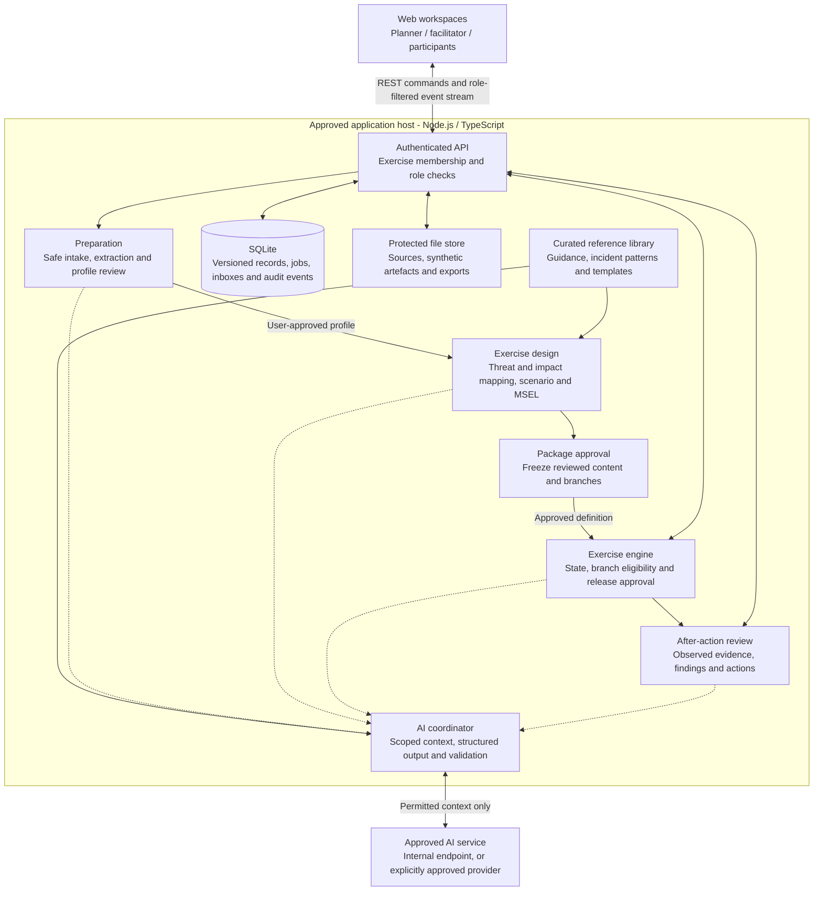
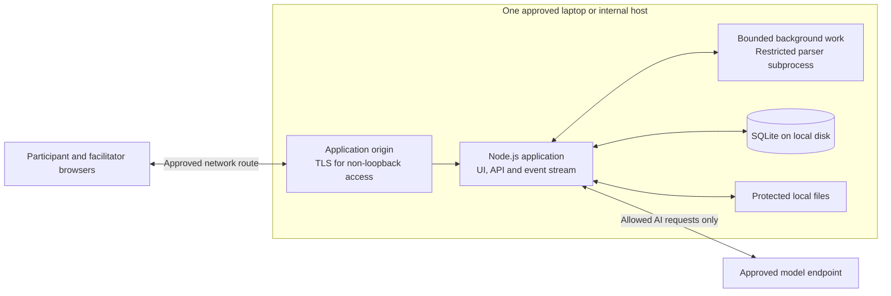

# AI-assisted TTX Platform Architecture

## Baseline integration — 15 September 2026

This remains the canonical architecture document. TASK-001A/B/C implement the bounded Docker-first profile and release workflow; TASK-005 adds an operational development entry. Verification results belong in WORK. Response capture, full completion, reviewed multi-inject content, AI, parsing and reporting remain planned.

Use [PROJECT](PROJECT.md) for working requirements and environment constraints, [DECISIONS](DECISIONS.md) for accepted versus proposed choices, [QUALITY](QUALITY.md) for verification criteria and [WORK](WORK.md) for actual state. Historical research and technology recommendations below do not establish current approval or installation.

Current delivery rule, 4 October 2026 (ADR-021): Form B controls scope. Prove the deterministic loop, deliver five injects first, then expand to ten and complete the remaining mapped Form B outcomes before extra features. Build the operational development skeleton in parallel. Profile-grounded package generation and approved-branch recommendation are required baseline capabilities; the earlier predefined-only authoring choice cannot replace generation. The coached/readiness-expanded workflow and diagrams below are historical extension designs, not baseline prerequisites.

The first slice uses a synthetic profile and prepared inject. Build only the profile/definition, approval/release, participant projection, response and durable activity boundaries it needs. Intake workers, AI coordination, retrieval and reporting come later; no speculative module directories are needed now.

The separate [organisation package](organisation/example-sme-01/README.md), authorised under ADR-019/020, is authored context documentation. Its master register supplies a common brief/reference and role-specific baseline cards; author-only provenance, name checks, legal analysis and knowledge allocation remain separate. Role cards are not a common bundle or approved exercise RACI. This file separation does not implement participant projection or release approval; future delivery must enforce recipient-specific selection server-side. The register is not an application schema, imported profile or replacement for `src/server/fixture.ts`; company authority is not TTX access authority. Scope is in [PROJECT](PROJECT.md#organisation-foundation), and verification/status remain in WORK.

### Shared contract and release design

The scaffold uses application-owned TypeBox JSON Schemas with inferred TypeScript types, strict AJV validation on the server, interpreted TypeBox validation in the browser (without weakening CSP) and explicitly projected API responses. [Profile contracts](../src/contracts/profile.ts) and [exercise contracts](../src/contracts/exercise.ts) cover identity, profile confirmation, track-bound packages/runs, preparation, approval, release, recipient briefing/inbox and activity. No supplied schema, expression or generated code is executed.

During scaffolding, define executable schemas once in an application-owned contracts module. UI, API, persistence mapping and future AI parsing consume or derive from that source. Section 6 is a conceptual inventory, not an executable schema.

Specify stable IDs and immutable profile/definition/inject revisions; run and membership references; allowlisted participant payloads; approval actor, content hash/revision, recipients and expected run revision; release idempotency keys; response author/team and released-inject reference; ordered event IDs and timestamps. Validate references as well as fields, and represent unknown values explicitly.

Release checks authority, run state, definition membership, eligibility, content revision and recipients in the authoritative transaction. Approval, release, inbox and activity changes commit consistently. A repeated successful idempotency key returns its existing result; reuse with different content fails. Concurrent requests check expected run revision. Participant projections exclude private material server-side. Restarted interrupted runs remain paused until explicitly resumed.

Current implementation (ADR-023): [ExerciseService](../src/server/exercise-service.ts) owns application rules; [ExerciseStore](../src/server/exercise-store.ts) uses the existing SQLite connection/transaction boundary. Additive schema v2 preserves v1 profile data and adds immutable packages, runs/memberships, preparation, approvals, releases/recipient links, command receipts and ordered activity. Startup seeds missing fixtures only and pauses active runs with a system recovery event. It never restores removed memberships or overwrites a stored package. One local application process owns a data volume; opening a second application instance against the same volume is unsupported.

Every new mutation checks the session-derived actor and run membership, package/track binding, expected run revision and command payload. Approval records the package/inject hashes and revisions, exact recipients, assignment fingerprint and resulting run revision. Release revalidates them and current profile/preparation in the same immediate transaction as the receipt, recipient links, activity and command result. Database uniqueness also prevents a second release for the same run/inject. A successful exact-key retry returns the historical receipt, even after pause/restart, without performing a new release; membership is still required. Pause/resume/recovery invalidate unused approvals by advancing the run revision. No completion command or response-dependent progression is implemented.

Participant briefing allows only common context/references and that participant's role. Inbox selection is restricted in SQL to assigned release recipients, then explicitly projected without approvals, hashes, recipient lists, future injects or private notes. An inbox receipt means content is available, not that anybody viewed it, contacted a supplier or performed a real action. The UI preserves an uncertain mutation's original payload/key for retry; after a full page reload, refresh authoritative state rather than assuming a failed HTTP response means no write occurred.

### Exercise-based implementation ownership

Updated under ADR-012/014/015/021/023. [PROJECT](PROJECT.md#ownership-and-exercise-scope) owns the assignment: the user implements the technical exercise end to end; the other worker handles the operational exercise. Both use the track-neutral TTX Platform application. The assigned-exercise selector displays only server-authorised runs; technical and operational content are separate modules behind the shared contracts and engine. The [operational handoff](operational-handoff.md) identifies current entry points and ownership. A runnable development fixture is not a complete operational exercise. ADR-006/007 cover the local Docker scaffold; WORK records installed and tested behaviour.

| Technical area / owner | Responsibilities | Suggested locations once needed |
| --- | --- | --- |
| Backend / user | HTTP API, identity and membership checks, application rules, SQLite persistence, activity, AI jobs and provider adapter, integration tests | `src/server/`, `src/server/adapters/`, `tests/server/` |
| Frontend / user | Profile review, facilitator and participant views, API client, loading/error states, accessible interactions and UI checks | `src/ui/`, `tests/ui/` |
| Contracts and integration / user | Executable request/response schemas, generated types/API description where practical, synthetic response examples, error codes, contract changes and end-to-end checks | `src/contracts/`, `tests/fixtures/` |

These paths are a proposed minimal layout, not directories to create in advance. Frontend and backend remain separate application boundaries despite having one owner. Backend-only profile evidence and facilitator records must not be bundled into participant-facing types or payloads. Share contracts between layers, not server implementation or secrets.

The user coordinates root package configuration, lockfile and shared contract changes. Integrate one behaviour at a time. Frontend mocks use the same reviewed synthetic examples and schemas as backend checks; mocks are not evidence that permissions or persistence work. Run a real browser-to-server check at every checkpoint. For the operational handoff, define the exact shared artefacts and interface ownership first, use separate Git checkouts/branches and local test data/volumes, and do not edit the same synchronised working directory from two machines.

### Operational development skeleton

Implemented design under ADR-021/023; acceptance and implementation status belong to [TASK-005](WORK.md#task-005---operational-development-skeleton). This is the smallest runnable integration boundary for parallel development, not a second application or a full operational exercise.

- Reuse the current React/Fastify/TypeBox/SQLite/Docker stack and identity boundary. Add only the composition points actually used by the operational entry and the first technical run. Do not create a generic plugin framework or empty future modules.
- Agree an application-owned track identifier (`technical` or `operational`) on package/run contracts as they are introduced. A run binds its package and track; validate this server-side. Profile facts remain reusable organisation context, not overwritten when a different track is selected. A URL or client-selected track does not grant access.
- Keep general revision/approval/release, recipient projection, response, activity and lifecycle rules shared as TASK-001 implements them. Track-specific content, expected actions and later rules stay in clearly owned modules. Technical constants must not become default operational requirements.
- Supply one explicitly synthetic development fixture and a server-backed read/validation path exposed through the operational entry. It tests integration, not exercise realism or approval. Keep unimplemented play actions unavailable rather than returning fabricated success. Each supported shared operation needs access and track-binding tests before exposure.
- Sequence length belongs to the reviewed package. The first playable technical package has five inject positions and the later target has ten. Validate the applicable milestone/package bounds; no global exactly-five completion check or mandatory two-answer state machine.
- Handoff records the entry points, executable schema examples, extension/test locations, shared-file ownership, startup commands and limitations. The other worker owns operational content and track-specific behaviour, using independent branches/checkouts and private local data. Coordinate shared schema/migration changes instead of duplicating them.

The [operational fixture](../src/server/operational-fixture.ts) binds `operational-development/package-r1` to `operational-dev-01`. A separately generated `operational` demo identity has membership only in that run and no profile-review membership. Its review route returns validated synthetic development context; `kind: development-skeleton`, an explicit hold and zero injects make it non-playable at both UI and service boundaries. The technical fixture and its private notes are not returned. Fixtures are server-side, never imported into the browser bundle. This implementation adds no provider, dependency or deployment selection.

### Step 0 - Baseline preparation

Design under ADR-022/023 and [REQ-020](PROJECT.md#step-0---baseline-preparation), implemented only for the bounded engineering fixture. Keep the short briefing within package/run preparation rather than adding a separate readiness service. Reuse reviewed profile/reference facts and role assignments; present common context and recipient-specific reference material through server-side projection. Do not reveal author-only gaps or evaluation material to every participant.

The package binds the profile revision/hash, briefing revision, common references, role briefings and gap dispositions. Start requires the exact current confirmed profile, reviewed package and assignment hashes, explicit briefing/gap/simulation acknowledgements, no hold and an assignment for every defined role. Its durable preparation record stores actor, time and those hashes; start/activity commit together. Recheck preparation before approval, release and resume. A changed package or assignment fails closed; a new revision/run and review are needed because in-place preparation editing is not exposed. Profile confirmation alone is not that record. Briefing does not approve an inject, verify that a real contact answered or alter the five/ten-inject count. No automated CTM score, contact-dialling integration or additional provider is needed.

Standards checked on 4 October 2026 against CSA's current linked publications: [Cyber Trust (2025)](https://isomer-user-content.by.gov.sg/36/2cff8d23-0f79-4477-9629-377d3bccbcaf/cyber-trust-v202504.pdf), pp. 6 and 106-108, identifies Supporter, Practitioner, Promoter, Performer and Advocate as tiers 1-5. B.21.1/2 reference Cyber Essentials A.9 requirements/recommendations; B.21.3 adds contact verification at Promoter. B.21.4 concerns exercises, B.21.5 post-exercise/incident improvement, and B.21.7/8 crisis integration and senior-management reporting. [Cyber Essentials (2025)](https://isomer-user-content.by.gov.sg/36/47c6066b-71a7-449f-82e0-e8cf10ee126f/cyber-essentials-v202504.pdf), A.9.4(a/b), pp. 45-47, already requires a basic response plan with roles and escalation communications, communicated to employees. This supports the expected foundation, not an automatic tier-failure inference from an unanswered exercise question or missing upload.

The authored pack's current SOC contact record and stale printed duty card are distinct facts. Preserve them and missing/rehearsal evidence until reviewed for the selected scenario; do not relabel the fixture as having passed lower tiers. The engineering briefing explicitly uses a controller to represent the incident lead, cover and suppliers for a delivery check only. It neither imports `org-draft-0.3` nor resolves the historical profile's uncertain facts. Reviewed scenario-specific starting arrangements remain work for the five-inject baseline.

### Screen storyboard - 20 September 2026

Historical screen concepts: ADR-016 superseded this storyboard's intake-before-track preparation order; ADR-021 now gates both designs to Form B. The [five-inject workflow](diagrams/ttx-five-inject-workflow.svg) includes deferred coaching/readiness features and has not been reconciled with the new milestone sequence. Use PROJECT for the current five-then-ten baseline. These screens and their Figma copy are layout references, not the current navigation specification or an extra readiness-specification prerequisite. No Figma update is implied by a local planning change.

The [editable Excalidraw storyboard](diagrams/ttx-screen-concepts.excalidraw), [SVG](diagrams/ttx-screen-concepts.svg) and [PNG preview](diagrams/ttx-screen-concepts.png) show nine desktop screen concepts for the TTX Platform. An [editable Figma copy](https://www.figma.com/design/4oCPzxBPHnEpsp4qRz2YV3?node-id=1-2) in 2301777's team preserves the imported text/vector layers; changes there do not automatically update the local scene or exports. These are design artefacts, not screenshots, implemented navigation or approval of new requirements. The proposed shared sidebar is not present in the current application. WORK records verification, earlier integration failures and the successful upload.

| Screen | Design status |
| --- | --- |
| 01 Workspace sign-in | Existing capability, simplified layout concept |
| 02 Organisation intake | Planned synthetic network/BCP/DRP input and upfront SOC/MSSP context |
| 03 Profile review | Existing evidence/confirmation capability, simplified layout concept |
| 04 Exercise setup | Planned separate-track selection and reference/membership readiness |
| 05 Package review | Planned five-slot review layout; no inject content generated |
| 06 Facilitator control | Planned paused/recovered-run example with release unavailable |
| 07 Participant response | Planned released-content-only view and initial agreed answer |
| 08 Coached retry | Planned criterion-linked feedback and second/final answer |
| 09 After-action review | Planned evidence-linked report layout, subject to the supplied template |

The technical track is an example context within neutral product branding. Detailed operational screens and cross-workstream contracts remain unagreed. Pending RACI mappings, rubric thresholds and AAR sections are not invented. Captions distinguish illustrative state from observed activity; preparation, release and report-sharing controls are design proposals, not evidence of runtime enforcement. Mobile layouts, interactive prototypes and the full set of error/loading states remain subsequent design work.

`node docs/diagrams/generate-screen-concepts.cjs` regenerates the editable scene and its screen index using only Node built-ins. SVG/PNG are separate Excalidraw exports and must be refreshed after scene changes. The generator is a documentation utility, not an application dependency or part of the container runtime. Editable native vectors keep the storyboard portable without a Figma plan upgrade; maintaining matching exports is its small additional cost.

### Scaffold dependencies and runtime

Exact direct versions live in package.json; package-lock.json freezes transitive resolution. Node 24.19.0 in the Debian slim image is the container baseline. Do not update the image/packages silently; rebuild and rerun verification when updating them.

| Choice | Purpose and alternative | Maintenance cost |
| --- | --- | --- |
| React / React DOM, Vite and React plugin | Profile review UI and static build; a plain HTML UI would reduce dependencies but diverge from the planned React workflow. | Browser/build compatibility and dependency/security updates; no separate production frontend server. |
| Fastify, static and cookie plugins | One HTTP boundary, static assets and cookie parsing; native HTTP would require more routing/validation plumbing. | Keep plugins compatible with Fastify; explicitly reject extra input fields rather than silently stripping them. |
| TypeBox, AJV and ajv-formats | JSON Schema plus inferred types, strict boundary/stored-fixture validation; manually duplicated interfaces or a second schema library were rejected. | Pin the schema dialect and format behaviour; compile only application-owned schemas, never supplied schema/code. |
| Node built-in SQLite | Short local transactions without native npm compilation; better-sqlite3 is the alternative if the runtime API proves unsuitable. | The SQLite API is coupled to the selected Node runtime; isolate it behind the store and test on the pinned image. Synchronous writes are appropriate only for this small single-host demonstration. |
| Lucide React | Familiar interface icons rather than custom icon drawing. | Small UI dependency; import only used icons. |
| TypeScript, tsx and type packages | Type checking, backend build and test execution. | TypeScript 6.0.3 is selected within typescript-eslint's supported range, rather than unsupported TypeScript 7. |
| ESLint / typescript-eslint and Prettier | Actual lint and formatting checks. | Keep parser/compiler versions aligned; existing historical docs are not bulk reformatted. |
| Node test runner and Playwright | Deterministic contract/API/persistence tests and real browser verification. | Browser downloads exist only in the optional browser-test image, not the runtime image. No ordinary check depends on live AI. |

Docker Compose uses a named volume outside the source tree and publishes only a loopback port. No Git credentials, Docker socket or host home directory are mounted into the app. Initial generated access codes are stored with restrictive file permissions in that volume and are displayed only by an explicit local operator command, not server logs. Sessions expire and are invalidated on restart; durable profile confirmations remain. Host/container administrators still control this local prototype.

Profile revisions are immutable snapshots with a content hash; confirmation names the exact revision/hash, records the server-derived actor and commits an activity event atomically. Assumptions, unknowns and conflicts remain labelled after confirmation; confirmation accepts the bounded snapshot, not the truth of missing data. Duplicate confirmation returns the existing record; stale revisions and unauthorised identities fail. No profile evidence is returned to participants.

Documentation basis: [Docker Compose](https://docs.docker.com/compose/gettingstarted/), [Docker volumes](https://docs.docker.com/engine/storage/volumes/), [Fastify schemas](https://fastify.dev/docs/latest/Reference/Validation-and-Serialization/) and [Node SQLite](https://nodejs.org/api/sqlite.html). Runtime behaviour must still be checked on the pinned Node 24 image.

### Browser API contract

The [profile schemas](../src/contracts/profile.ts) and [exercise schemas](../src/contracts/exercise.ts) define the implemented internal frontend/backend boundary shared by both workstreams. Routes below are implemented unless marked planned. The frontend talks only to the TTX API. The server derives the actor from its session; request bodies and track labels cannot select authority. Executable examples and ownership are in the [operational handoff](operational-handoff.md).

| Checkpoint | Route | Contract purpose |
| --- | --- | --- |
| Identity | `POST /api/session`, `DELETE /api/session` | Validate generated access code or revoke the current session |
| Profile | `GET /api/me` | Current demonstration identity; run authority is checked separately |
| Profile | `GET /api/profiles` | Profiles the authenticated facilitator may review |
| Profile | `GET /api/profiles/:profileId/activity` | Authorised profile confirmation activity |
| Profile | `GET /api/profiles/:profileId/revisions/:revisionId` | Authorised profile review projection with explicit unknowns |
| Profile | `POST /api/profile-confirmations` | Confirm an exact profile revision; return durable confirmation |
| Exercises | `GET /api/tracks/:track/runs` | Assigned runs only; at most 100 |
| Review | `GET /api/tracks/:track/runs/:runId/review` | Facilitator package, membership, hashes, preparation, current approval and releases |
| Preparation/lifecycle | `POST /api/tracks/:track/runs/:runId/start`, `.../pause`, `.../resume` | Revision-checked, idempotent facilitator commands; start includes Step 0 acknowledgements |
| Release | `POST /api/tracks/:track/runs/:runId/approvals` | Approve exact reviewed inject revision and recipients against expected run revision |
| Release | `POST /api/tracks/:track/runs/:runId/releases` | Release with approval reference, expected run revision and idempotency key |
| Participant | `GET /api/tracks/:track/runs/:runId/briefing`, `.../inbox` | Role-appropriate starting context and accessible released content only |
| Participant / planned | Response route not yet specified | Record agreed actions, rationale and information requests referencing an accessible release |
| Activity | `GET /api/tracks/:track/runs/:runId/activity` | Latest 100 facilitator-visible events in ascending sequence; full history remains in storage, pagination not implemented |
| Historical AI route sketch; generation required by ADR-021 | `POST /api/ai/inject-proposals` | Baseline needs package generation; exact job/input/output contracts remain to be specified |
| Proposed AI job interface | `GET /api/ai/jobs/:jobId` | Output contract awaits the reviewed baseline feasibility checkpoint |

Use the safe `{ error: { code, message } }` envelope. Unauthenticated requests return 401, forbidden membership/role 403, invalid inputs 400 and stale/bound-state conflicts 409; internal details are not exposed. Duplicate successful command retries return the original result; key reuse for different content is a conflict. Lifecycle completion, editing, response and AI contracts must be specified in their checkpoints before their screens depend on them. This is not the complete MVP API.

### Proposed Codex adapter experiment

Scope correction, 4 October 2026 (ADR-021): Form B requires both profile-grounded package generation and response interpretation/approved-branch recommendation. TASK-002 first proves one bounded operation after the deterministic loop; success there does not complete both capabilities. The earlier API sketches and provider details below remain proposals requiring fresh verification before implementation. Coaching is not a baseline prerequisite, and no live provider is newly approved by this planning update.

Intended adapter boundary: facilitator UI -> TTX API -> bounded AI job -> backend adapter -> validated proposal -> facilitator review. The existing approval/release transaction remains the only path to participant inbox availability. A Codex tool approval is never a TTX release approval.

Official protocol basis, checked 15 September 2026: `codex app-server` supports stdio. Complete `initialize` / `initialized`, inspect `account/read`, and use managed `account/login/start` with `type: chatgpt` when needed. Start a thread and `turn/start` with an application-owned `outputSchema`. Collect final output and check the terminal `turn/completed` status; it can indicate failure or interruption. Pin the CLI and generate matching protocol types. The documentation labels app-server experimental and unsupported for production workloads. [Official app-server documentation](https://learn.chatgpt.com/docs/app-server)

Subscription sign-in and API-key billing are separate access modes; an unavailable subscription must not silently fall back to paid API usage. [Official authentication documentation](https://learn.chatgpt.com/docs/auth)

Application design to prove in the experiment:

- Backend supervises one local process through private pipes, with bounded message sizes, correlated request IDs, timeouts, cancellation and exit handling. Windows executable resolution and process cleanup require testing.
- Operator signs in locally through the managed flow. Keep credentials and provider history outside source control/OneDrive. Frontend development and ordinary tests use a fake adapter; this plan does not grant the operational worker access to the user's account. Do not copy account tokens or expose Codex's general protocol to the browser.
- Use an isolated runtime configuration and working directory, not the development repository or live database directory. Audit inherited instructions, plugins, hooks and MCP configuration. Enforce no model access to shell execution, application storage, credentials or delivery tools. A prompt saying "do not use tools", a read-only filesystem setting, or declining approval requests alone does not prove this boundary. Verify supported restrictions on the selected Windows build before connecting participant-supplied text; fail the experiment if the required isolation cannot be enforced.
- Supply only the selected synthetic profile snapshot, objective and allowed roles/assets. Start fresh context per independent generation job. Store request/profile/contract/prompt/model versions and the resulting draft provenance without logging secrets.
- Treat model output as untrusted data. Validate schema, references, bounds and profile revision; preserve unknowns; reject unsupported references. Human review still assesses plausibility and factual support.
- Persist an application job before requesting generation. Return `202` with a job ID; frontend polls initially. Proposed statuses: queued, running, succeeded, failed, cancelled. Success means a validated draft was stored, never approved or released. Show safe failure codes for rate limits, sign-in required, invalid output and provider unavailability.
- Bound concurrency to one generation for the initial experiment. Prevent accidental duplicate jobs, discard late results after cancellation and mark interrupted jobs explicitly on restart. Do not automatically replay uncertain provider requests. Manual play continues in every failure case.

### Five-inject coached workflow - 18 September 2026

Status: historical combined design under ADR-013/016/017, not implemented. ADR-021 retains five as the first playable count, followed by ten, but defers coaching and additional readiness machinery. [PROJECT](PROJECT.md#first-exercise-draft) owns the current intermediate scope. The detailed coached flow below is not a baseline prerequisite. TASK-001's deterministic first slice and exact-revision release approval remain intact.

[Editable Excalidraw diagram](diagrams/ttx-five-inject-workflow.excalidraw), [SVG](diagrams/ttx-five-inject-workflow.svg) and [PNG preview](diagrams/ttx-five-inject-workflow.png).

The diagram shows five injects in one track, not a mixed-track run. It has not been redrawn for ADR-021: its mandatory coaching and expanded readiness stages are deferred, while Form B's generation requirement is restored. Review baseline role assignments, expected actions/evaluation criteria and branch content before use, but do not make the additional coaching rubric or readiness engine a dependency. All organisation/exercise content remains synthetic. The operational skeleton is a separate parallel handoff, not implemented support inferred from the diagram.

Historical extended flow, subject to the scope gate above:
1. An authorised planner establishes purpose, one track, intended audience and initial scope. Both technical and operational product tracks remain discussion-based TTXs. Detailed operational requirements and integration still need agreement.
2. Reuse a reviewed organisation profile, provide supported synthetic documents, answer guided questions, or combine these. Source categories should cover network context, IRP/playbooks, inventory and relevant continuity/recovery material when their contracts are implemented. No particular file title is a universal prerequisite. Exercise participants need not have upload or profile-confirmation authority.
3. AI proposes source-linked information and targeted questions against the selected objectives. A human reviews facts, assumptions, conflicts and unknowns. Include relevant business services, assets/data, dependencies, impact and the SOC/MSSP operating model. Reuse shared facts; keep exercise assumptions separate. Asset criticality requires reviewer confirmation.
4. Refine objectives and scope from the available context. Confirm the exact profile revision and exercise plan separately, including role-to-user/team mapping, relevant references and evaluation approach. Context readiness is an application-owned check with recorded human decisions, not an inference from profile confirmation. Its detailed criteria and question/stopping rules await the user's specification. Unresolved essentials lead to more available evidence, revised scope, reviewed exercise assumptions/fictional context where appropriate, or a saved draft awaiting information.
5. Bind reviewed objectives, roles, reference versions and evaluation criteria to a predefined scenario with five inject positions and bounded alternatives. Review every permitted path for objective coverage, response conditions, consistent consequences, evidence and acceptable decisions; freeze the package. Each run presents one reviewed variant per position. Package readiness is distinct from context readiness. AI generation of the scenario is not a current-draft prerequisite (ADR-018).
6. Brief participants with the approved context, roles and ground rules. Check run readiness, including assigned participants and the applicable package. A facilitator then approves each exact inject and its recipients. The application rechecks authority and run state at release, independently of AI assessment.
7. Route each task using the confirmed SOC/MSSP mapping and approved RACI. Bind responsible roles to actual responding users/teams; accountable/consulted/informed roles retain their distinct functions. RACI accountability does not automatically confer facilitator privileges. Capture the agreed response and distinguish information requests from assessed answer submissions according to the later reviewed interaction contract.
8. AI proposes criterion-level findings with response evidence. Application-owned validation and reviewed thresholds determine eligibility, with human review of ambiguous or disputed assessments. A sufficient first answer closes the inject. An insufficient first answer receives targeted guidance before one final answer. If that second answer remains insufficient, record an unresolved finding and reject a third answer. Record first-attempt success on this inject, coached success and unresolved findings separately. Select the next eligible reviewed variant using the bounded adaptation design below, then use normal facilitator approval/release checks. Progression must not imply a failed action succeeded; any required controller assumption is explicit and preserves the original outcome.
9. Resolve all five slots, then gather attributed debrief feedback from participants and the facilitator. Draft the AAR from the activity/debrief record and approved template. A human verifies findings and improvement actions before sharing the appropriate participant report. Assign action owners and due dates; record later closure evidence rather than declaring proposed improvements complete. Early termination can yield a clearly labelled partial report; unresolved gaps must not be reported as passes.

Design boundaries: a risk matrix prioritises scenario risks; an assessment rubric evaluates responses. Neither is an executable user-supplied schema. Grade substantive decisions and justified alternatives, not answer length. The first draft includes adaptive feedback and bounded, reviewed scenario alternatives under ADR-017. Freeze the rubric during a run and keep hidden criteria, future injects and facilitator evidence out of participant payloads.

The backend counts accepted answer submissions for the authorised responding user/team, not HTTP retries or model calls. Persist each answer and its attempt number before evaluation. A duplicate request returns its recorded result; a provider failure leaves that answer pending evaluation instead of inventing a failed assessment or consuming a further answer. Human review reassesses the same evidence and records its rationale without resetting the two-answer limit. A terminal outcome is either sufficient (first-attempt/coached) or an unresolved finding; every one of the five injects needs such an outcome before normal completion. Earlier coaching can influence later first attempts. The AAR retains these outcomes and their evidence rather than collapsing completion into a pass score or claiming wholly unaided readiness.

For AI-assisted stages, treat subscription-backed Codex as an adapter feasibility path, not an unlimited or already-working runtime. Managed ChatGPT authentication is documented separately from API-key usage; limits and data-handling arrangements still apply. Local file access depends on the host's tools and permissions, and file parsing remains a separate capability to validate. See [authentication](https://learn.chatgpt.com/docs/auth), [usage limits](https://learn.chatgpt.com/docs/pricing) and [app-server](https://learn.chatgpt.com/docs/app-server).

Recommended continuity design: the backend owns versioned profiles/reference packs, run state, all attempts/hints, assessments and human decisions. Build a bounded context packet for every AI request from those records. An optional per-run `memory.md` is only a derived summary with record/version references, rebuilt or checked against authoritative data before use. Do not rely on an agent remembering to update it, global cross-chat memories or context compaction for transactional correctness. This creates no competing repository MEMORY document; live exercise data remains outside the synchronised source tree. Give the runtime selected read-only material, not unrestricted folder, credential or database access. [OpenAI's memory guidance](https://learn.chatgpt.com/docs/customization/memories) likewise distinguishes recall from required guidance.

Positioning: support exercise practice and review evidence relevant to Cyber Trust, not automatic certification or proof of real recovery. The [current CSA certification page](https://www.csa.gov.sg/our-programmes/support-for-enterprises/sg-cyber-safe-programme/cybersecurity-certification-for-organisations/cyber-trust/certification-for-the-cyber-trust-mark/) points to Cyber Trust (2025); the 2022 version ceased use in February 2026. Map the selected objectives to the [2025 clauses](https://isomer-user-content.by.gov.sg/36/2cff8d23-0f79-4477-9629-377d3bccbcaf/cyber-trust-v202504.pdf), and do not treat a five-inject result as Advocate-tier attainment.

---

### Bounded adaptation design - 24 September 2026

Planning under ADR-017/021 and [REQ-018](PROJECT.md#bounded-adaptive-injects); no branch engine or contracts are implemented. Approved-branch recommendation is Form B baseline scope, with three key decision points at final acceptance. Preserve the reviewed package's position count (initially five, later ten), learning objectives and consequences across permitted paths. Adapt later information, not objectives or assessment standards to make an answer pass. Coaching-specific progression remains deferred.

1. During preparation, review a small set of variants at selected inject positions. Each records its intended objective, eligible preceding state/response conditions, consequences and route to later positions. Validate that every permitted complete path reaches all required learning opportunities and closure within the reviewed package's count, without cycles or unrelated events. Exact branch locations, alternative limits and content remain pending package design.
2. Record the agreed response and facilitator progression decision before selecting the next variant. Build AI context from the immutable profile/package, released variants, recorded responses, interpretations and scenario consequences. The response informs progression; a grading label alone cannot establish an action. Distinguish tabletop decisions and simulated consequences from actions observed on real systems. Do not impose the deferred two-answer coaching rule.
3. The application determines eligible alternatives. AI recommends a candidate with response evidence and rationale, or abstains; the facilitator confirms the choice. Persist the selection, conditions/evidence used, human decision and revisions. Exact-content, recipient and run-state checks still apply at release. A retry or restart must not select or release a second variant for the same position.
4. Reconnect branches at common exercise stages using state-consistent variants. Retain impacts and unresolved issues in later injects and the AAR. If no reviewed variant fits an unexpected response, pause for review; do not invent a new live branch, force a correct answer or silently reset the incident. Material content/scope changes require revised package review and fresh release approval.
5. On AI failure or uncertainty, the facilitator can select an eligible reviewed alternative with a recorded reason, or pause. Evaluation uncertainty remains visible and does not become an automatic failure, recovery or progression. Participant views expose only released material, never the alternative graph or private grading evidence.

The AAR records the actual path, rationale, response evidence and unresolved findings. Compare evidence with the path's learning opportunities; different consequences do not justify unqualified aggregate comparisons. First-attempt/coached outcome accounting belongs only to the deferred extension. See [QUALITY](QUALITY.md#bounded-adaptation-cases) for planned checks.

### ENISA adaptation and implementation boundaries - 22 September 2026

Planning reference: ADR-016, gated by ADR-021 and [PROJECT](PROJECT.md#exercise-preparation-and-review-flow). Use the methodology to inform required baseline preparation/review. The separate detailed readiness engine is deferred and its specification is not a baseline prerequisite. This section preserves the expanded design, not additional mandatory acceptance criteria.

Reference: ENISA, *The ENISA Cybersecurity Exercise Methodology*, version 1.0, February 2026 ([official publication](https://www.enisa.europa.eu/publications/the-enisa-cybersecurity-exercise-methodology)). The supplied local copy is in the ignored references folder. Page numbers below are printed pages, one less than the PDF page index counted from one. This adaptation uses the lifecycle and objective/evidence relationships; it does not import EU duties, national-exercise staffing or planning-duration estimates as SME prerequisites.

| ENISA basis | Platform adaptation |
| --- | --- |
| Initiation, sections 1.1-1.5, pp. 9-18 | Purpose, exercise focus, context and feasibility before detailed preparation |
| Design, sections 2.1-2.3, pp. 20-23 | Objectives, scope, dependencies, audience and roles refined from available context |
| Preparation, sections 3.1-3.3, pp. 27-35; Figure 8, p. 31 | One scenario and ordered injects with recipients, expected decisions, evaluation criteria, evidence and a player briefing |
| Execution, sections 4.1-4.3, pp. 39-43 | Readiness checks, controlled release, recorded responses/interventions and debrief feedback |
| Evaluation, section 5.2, pp. 48-49 | Human-reviewed, evidence-linked AAR with limitations |
| Moving forward, section 6.2, pp. 53-55 | Prioritised actions with owners, due dates, status and later verification |

ENISA distinguishes discussion-based and operation-based formats (section 1.2). Our technical and operational tracks both use the discussion format. The two-attempt coaching model is a declared learning-focused adaptation: keep initial and coached outcomes separate, account for prior hints, and do not equate discussed decisions with executed technical actions. Neutral observation in ENISA section 4.1.3 is a reason to disclose coaching, not to erase the accepted coaching scope.

Maintain three distinct kinds of records when their implementation is authorised:

- Organisation profile: versioned, reusable source-linked information, including uncertainty, selected services/assets, dependencies, ownership and impact. Sources are evidence, not executable instructions. Guided answers are attributed sources; absent files do not prove absent plans.
- Exercise plan: purpose, selected track, objectives, scope, participants/role mapping, reference versions, evaluation approach and exercise-only assumptions. Revising a plan does not overwrite the organisation profile.
- Readiness decisions: context, package and run decisions tied to their applicable profile/plan/package and checklist revisions, reasons, unresolved items and reviewer. Changing dependent revisions requires re-evaluation. Confirmation alone does not unlock drafting or play.

The backend owns authoritative state and application checks. AI proposes extracted information, targeted questions, drafts and evidence-linked assessments. It cannot invent missing facts, approve its own readiness result or change review rules. A persistent reviewed profile supplies task-specific AI context; conversational recall is not the authoritative organisation memory. An uncertainty may intentionally be exercised only when the approved objective and evaluation criteria support that choice.

Implementation map (all additions below remain planned):

| Existing area | Later change |
| --- | --- |
| `src/contracts/profile.ts` | Extend source categories and reviewed profile fields for relevant plans/playbooks and service/asset/dependency information; preserve existing provenance and synthetic-only constraints. The current `setup` source already permits guided-answer provenance conceptually. |
| `src/server/profile-service.ts` | Keep revision-specific confirmation. Add separate objective-dependent readiness operations only after reviewing the user's specification. |
| `src/server/storage.ts` | Persist exercise plans and readiness decisions as version-bound records; preserve confirmations and existing demonstration data through deliberate migrations. |
| `src/ui/main.tsx` | Add exercise intention ahead of detailed intake and separate confirmation/readiness displays in future checkpoints. Operational availability depends on agreed cross-workstream integration; do not add a working-looking unsupported route. |
| Planned package/run/review features | Bind objective, inject, criterion and evidence IDs; preserve exact release approvals, two-attempt history, debrief attribution and action ownership. |

At the time of this historical planning update, the next checkpoint was TASK-001C. Current implementation and next work are recorded in WORK. Full AI profiling and document ingestion remain dependent baseline work; the additional readiness engine is now deferred under ADR-021. This historical methodology section is not runtime evidence.

Diagram maintenance: `node docs/diagrams/generate-five-inject-workflow.cjs` regenerates the current editable Excalidraw scene and SVG from one layout definition. Its PNG is a rendered preview of that SVG. The attached Downloads SVG is a convenience copy; the repository workflow is the canonical diagram. The older screen storyboard/Figma copy and HTML component illustration are historical views and are labelled accordingly.

---

Status: historical proposed design for review, 9 September 2026. At that date no platform implementation had started; current implementation status is recorded above and in WORK.

The historical sections below describe the fuller target. Their 10-15 entries and three decision points are not first-draft requirements. ADR-017 now permits bounded alternatives in the five-position draft, but does not adopt every historical branching detail; current PROJECT and the workflow above take precedence.

Recommendation: a web-first, single-organisation prototype with a Node.js/TypeScript modular backend. AI assists preparation and interpretation. Application rules and recorded human approvals control what becomes an organisational fact, an exercise definition, a delivered inject, or a final finding.

## 1. Architecture diagram

```mermaid
flowchart TB
    UI["Web workspaces<br/>Planner / facilitator / participants"]

    subgraph APP["Approved application host - Node.js / TypeScript"]
        API["Authenticated API<br/>Exercise membership and role checks"]
        PREP["Preparation<br/>Safe intake, extraction and profile review"]
        DESIGN["Exercise design<br/>Threat and impact mapping, scenario and MSEL"]
        PACKAGE["Package approval<br/>Freeze reviewed content and branches"]
        RUN["Exercise engine<br/>State, branch eligibility and release approval"]
        REPORT["After-action review<br/>Observed evidence, findings and actions"]
        AI["AI coordinator<br/>Scoped context, structured output and validation"]
        STORE[("SQLite<br/>Versioned records, jobs, inboxes and audit events")]
        FILES["Protected file store<br/>Sources, synthetic artefacts and exports"]
        LIBRARY["Curated reference library<br/>Guidance, incident patterns and templates"]

        API --> PREP
        PREP -->|"User-approved profile"| DESIGN
        DESIGN --> PACKAGE
        PACKAGE -->|"Approved definition"| RUN
        RUN --> REPORT
        API <--> RUN
        API <--> REPORT
        API <--> STORE
        API <--> FILES
        LIBRARY --> DESIGN
        LIBRARY --> AI
        PREP -.-> AI
        DESIGN -.-> AI
        RUN -.-> AI
        REPORT -.-> AI
    end

    UI <-->|"REST commands and role-filtered event stream"| API
    AI <-->|"Permitted context only"| MODEL["Approved AI service<br/>Internal endpoint, or explicitly approved provider"]
```

The preparation chain shows the lifecycle. API-to-storage edges summarise persistence through the application modules, not browser access to the database. Dashed edges represent bounded AI calls and their validated results, not permission to advance an exercise. The browser receives only its authorised view of records.

The model has no delivery credentials, database access, shell, production-system connection or approval authority. AI unavailability must not prevent manual execution of an already approved package.

## 2. Requirements baseline

Form B is the authoritative delivery baseline under ADR-021, re-read from the user-supplied references folder on 4 October 2026. [PROJECT's source mapping](PROJECT.md#form-b-traceability) owns its requirements; the table below is an architectural summary. The user permits five initial injects before ten, not omission of generation, branching or other required outputs. Supporting slides/research do not override the brief or establish technology/deployment approval.

| Project requirement | Architectural response |
| --- | --- |
| One representative SME and one technical scenario | One organisation per deployment and one active run for the MVP |
| One agreed diagram format, optional text-based BCP/BIA/DRP and guided questions | Format-specific parsers feeding a common source and candidate-fact model |
| Assets, connections, services, roles, suppliers, RTO/RPO and exclusions | Versioned organisation profile with typed relationships and source references |
| Missing information, conflicts, assumptions and user confirmation | Reconciliation workspace and explicit profile approval |
| Controlled threat library, pathway mapping and draft package generation | Profile-grounded preparation separated from approved runtime content; no free-form live branches |
| 10-15 MSEL entries, 3-4 functional roles, three decision points | Bounded scenario definition with approved alternatives and a shared main storyline |
| Web delivery and agreed participant decisions | Role-specific inboxes plus actions, rationale and information-request submissions |
| Approve, edit, reject, override, pause and manual continuation | Server-enforced state transitions and approval records independent of the model |
| Draft AAR and improvement actions | Report generation from a fixed exercise-record snapshot with evidence references |
| Controlled evaluation and school-safe demonstration | Synthetic reference pack, independent human labels, control tests and sanitised exports |

Sources: local `references/GPT_ICT4011_Form_B_AI_Assisted_TTX.docx` (ignored and present in the primary checkout; identity recorded in PROJECT), [supervisor slides](../supervisor_AI%20TTX%20Idea.pptx), [research guide](../capstone_ttx_reference/AI_TTX_Research_Guide.md). The latter historical links may be unavailable in a source-only checkout.

Scope exclusions remain intact: no cyber range, exploit execution, malware deployment, production-system changes, autonomous attack activity, certification, proof of real recovery performance, production multi-tenancy, high availability or enterprise SSO. A scenario pathway is a reviewed hypothetical incident narrative, not a verified route into a real network.

### Source inconsistencies

- Some slide notes retain older CIIO/CCoP framing. Use the SME/Cyber Trust framing in Form B and the slide bodies. Do not import CII obligations or assume a Cyber Trust tier.
- Slide 6 mentions Slack discussion, while Form B and slide 7 specify a web interface. The MVP records agreed decisions in the web application. Slack/Discord integration and a participant chatbot are deferred.
- The research guide describes the local ENISA PDF as a 56-page extract. The actual file inspected has 72 PDF pages. Treat the guide's inventory as historical rather than authoritative file metadata.
- Existing AI assistance and adaptive delivery are prior art. The comparison below refines earlier platform claims without editing the supplied reference materials.

## 3. Comparison and reuse decision

T3SF was downloaded for read-only source inspection. The reviewed `main` snapshot is commit `182ddc9b7bf804e93bbfe9d3f2112d8c20f7fec6`, dated 30 October 2023. Inspection covered the README, changelog, core orchestration, GUI handlers and example MSEL. It was not installed or executed. INJECT was reviewed through official documentation on 9 September 2026, without deployment testing.

| Dimension | T3SF evidence | INJECT evidence | Capstone proposal |
| --- | --- | --- | --- |
| Delivery | JSON MSEL, timed orchestration, Slack/Discord adapters and polls | Web views and conditional milestone progression | Native web inboxes and one authoritative exercise state |
| Authoring | MSEL editing and example event/scenario content | Definitions with roles, objectives, inject alternatives and questionnaires | Draft an exercise from an approved SME profile, then review it |
| AI | Changelog documents a database of AI-generated events | Definitions describe email/free-form LLM assessment; the LLM page focuses on sandbox hints | Grounded drafting and interpretation with approved follow-ups |
| Control | Pause/resume/stop controls | Instructor interaction and conditional progression | Package approval plus separate approval for every release |
| Technology | Python orchestration and Flask GUI in inspected source | Go backend, React/TypeScript frontend, GraphQL and REST; Linux/Docker Compose installation | Node.js/TypeScript backend, React frontend and local persistence |
| Reuse | Repository identifies GPL-3.0 | Official license page identifies MIT | Review actual component and content licenses before copying |

Evidence: [T3SF README](https://github.com/Base4Security/T3SF/tree/182ddc9b7bf804e93bbfe9d3f2112d8c20f7fec6), [changelog](https://github.com/Base4Security/T3SF/blob/182ddc9b7bf804e93bbfe9d3f2112d8c20f7fec6/CHANGELOG.md), [INJECT architecture](https://docs.inject.muni.cz/tech/architecture/overview/), [installation](https://docs.inject.muni.cz/tech/installation/overview/), [definitions](https://docs.inject.muni.cz/tech/architecture/definitions/), [milestone logic](https://docs.inject.muni.cz/INJECT_process/specify/milestone_logic/), [LLM integration](https://docs.inject.muni.cz/tech/llm-integration/), [license](https://docs.inject.muni.cz/license/).

Do not describe T3SF as having no AI, or infer project-wide abandonment solely from the reviewed commit date. INJECT documents assessment-related definition fields and corresponding [evaluation log records](https://docs.inject.muni.cz/tech/log-format/), but their behaviour in a specific release was not verified. The hints page is not evidence that assessment is absent elsewhere.

### Recommended reuse boundary

A small independent core is a scope and environment recommendation, not a claim that rebuilding everything is better. Form B names Node.js and approved internal services. The MVP does not require a larger platform's sandbox, communications or multi-exercise feature set.

Adopt T3SF's separation between an exercise definition and its delivery channel. Adopt INJECT's separation between definitions and running exercises, explicit conditions, role-aware content and exercise records. Keep three bounded decision points that reconnect to a main storyline rather than multiplying complete scenarios. These are design inferences, not compatibility claims.

An INJECT extension remains a credible alternative if the organisation already supports its deployment. It would retain our profile preparation and evidence model, then require a versioned definition exporter and proof that its integration enforces the required release approvals. A T3SF adapter is more relevant if Slack/Discord becomes mandatory. Neither should become a second simultaneous implementation track.

The contribution to evaluate is the complete, traceable SME document-to-exercise-to-improvement workflow, including human approval enforcement and bounded interpretation. Do not claim to invent adaptive TTXs or AI assessment.

## 4. End-to-end workflow

### Prepare the organisation profile

The planner defines scope and uploads the agreed diagram format and any supported continuity documents. Intake checks type, size and structure before parsing. Original files remain versioned. Extracted passages and diagram objects retain page, paragraph or cell locators.

Parsers recover structure; AI may propose semantic interpretations. A diagram connection is not automatically a business dependency, a trust relationship or an exploitable path. Store those relationship types separately. Missing details remain unknown rather than being inferred as organisational facts.

The review workspace shows candidate facts beside evidence, missing fields, conflicts and explicit assumptions. Guided answers become new source records. User approval freezes a profile revision. Corrections create another revision and invalidate affected drafts rather than silently changing an approved exercise.

### Design and approve the exercise

The designer matches the approved environment to a small curated incident-pattern library. Patterns contain applicability conditions, required assumptions, plausible disruption, decision objectives and synthetic evidence templates. They contain no executable attacks or production integrations.

AI drafts the scenario, objectives, MSEL and expected-action explanations within that context. Application checks cover IDs, roles, asset references, source references, chronology, artefact consistency, branch reachability and scope limits. A valid citation ID does not prove that a passage supports a claim; semantic review remains necessary.

The facilitator reviews the package, rubric, reasonable alternatives and three decision points. Approval freezes the definition and records the reviewer. Each run permanently references that definition version.

Proposed counting convention: 10-15 MSEL timeline entries, with alternative payloads attached to existing decision-point entries instead of separate complete storylines. Confirm how alternatives count toward the assessed inject total before content freeze.

### Conduct the exercise

Participants see only released evidence for their assigned role or shared team channel. Their group submits agreed actions, rationale and information requests. A designated submitter can record the collective decision; informal discussion is not automatically treated as the team's final answer.

The engine determines eligible branches from the approved definition and current state. AI interprets the submitted response against the rubric and those candidates. It returns evidence-linked observations and a suggested branch, or abstains. An unmentioned action is not observed, not automatically incorrect.

The facilitator can accept, select another eligible approved branch, reject, request clarification, or continue manually. A timing trigger makes an inject ready for review; it does not release it. Manual override bypasses the AI recommendation, not authorisation, definition membership or state validation.

### Review and improve

The evaluator reviews observations and participant feedback. AAR generation uses a fixed snapshot of the recorded exercise, not an AI reconstruction. Findings link to objectives, actual responses/observations, injects and relevant plan sections where available.

The reviewer confirms or corrects the report and action list. Actions record an owner, target date, status and eventual closure evidence. Recommendations do not overwrite plans or mark remediation complete. Keep this an action register, not a separate project-management product.

The platform can support discussion of selected Cyber Trust B.21.4/B.21.5 requirements and relevant continuity context. It cannot certify the organisation, prove restoration within an RTO/RPO, or represent a simulated supplier as an actual participating third party. Define evaluation before play, consistent with the local ENISA methodology sections 3.2 and 5.2.

## 5. Runtime approval sequence

```mermaid
sequenceDiagram
    actor P as Participant team
    participant API as Application API
    participant E as Exercise engine
    participant AI as AI coordinator and approved model
    actor F as Facilitator
    participant DB as State and audit store

    P->>API: Submit agreed actions, rationale and requests
    API->>DB: Store authorised, versioned response
    API->>E: Interpret response for current run revision
    E->>AI: Approved rubric, response and eligible branches
    alt Valid suggestion
        AI-->>E: Structured interpretation and candidate branch
        E->>DB: Store suggestion, evidence and model metadata
        E-->>F: Present suggestion for human review
    else Unclear response or unavailable AI
        E-->>F: Present manual choices or clarification
    end
    F->>API: Approve exact content and recipients, or choose manually
    API->>E: Authenticated release command and expected revision
    E->>DB: Recheck running state, eligibility and approval; commit atomically
    DB-->>API: Stable release ID and committed inbox entries
    API-->>P: Publish role-filtered event notification
    P->>API: Fetch authorised inbox; optionally acknowledge viewing
```

The database commit is authoritative. Persist approval, exact payload revision, recipients, state change, release record and audit event in one transaction. The event stream notifies browsers about committed inbox data. Viewing an inject is a separate fact from the server releasing it.

Use a release idempotency key and expected run revision. Repeated clicks cannot create duplicate releases. Approval becomes stale when its content, recipients, triggering response or required state changes; recheck at commit, not just when the review screen opens.

Paused and completed runs reject releases. Restarted interrupted runs enter recovery-paused state until the facilitator resumes; overdue injects are not automatically sent. Keep UTC timestamps, elapsed exercise time and fictional scenario time separate.

Editing approved content creates a new reviewed revision. Structural changes to branches, prerequisites or objectives require a pause, validation and renewed package approval. Never silently rewrite already released content or historical records.

## 6. Data and evidence model

| Record | Essential content |
| --- | --- |
| SourceDocument / SourceSegment | Hash, revision, classification, parser version, extracted text and page/paragraph/diagram-cell locator |
| CandidateFact / ProfileVersion | Entities, typed relationships, values and units, evidence, conflicts, unknowns, assumptions and human confirmation |
| ReferenceItem / IncidentPattern | Publication/version/locator, permitted use, prerequisites, synthetic templates and reviewer |
| ExerciseDefinitionVersion | Profile version, scenario assumptions, objectives, roles, MSEL, artefacts, rubrics and branch graph |
| ExerciseRun / Membership | Definition version, role assignments, state revision, exercise clock and status |
| ParticipantResponse / Observation | Author/team, agreed response revision, released inject, rationale, requests and evaluator notes |
| AISuggestion / AIJob | Input versions, task/prompt/model version, retrieved source IDs, validated result, failures, latency and reviewer disposition |
| Approval / Release / AuditEvent | Actor, action, content hash, recipients, state preconditions, stable release ID and ordered event sequence |
| AARVersion / Finding / Action | Evidence snapshot, objective/response/source links, review, owner/date/status and closure evidence |

Separate published guidance, organisation-supplied facts and approved synthetic exercise content. Retrieval filters by collection, organisation, exercise, revision and access permissions. Publisher examples cannot become SME facts. Future injects and answer keys cannot enter participant-visible retrieval.

Start with source IDs, metadata filters and ordinary full-text search. Add embeddings only if held-out retrieval tests justify them. A separate vector or graph database is unnecessary for the initial scope; typed entities and edges can be stored relationally.

Preserve the research guide's distinct evidence dimensions: source availability, document support, exercise coverage, operational verification and human review. Do not collapse them into a compliance score.

## 7. Technology and deployment proposal

These are recommendations, not installed dependencies or final procurement decisions.

| Layer | Proposed choice | Reason and boundary |
| --- | --- | --- |
| Browser | React, TypeScript and Vite | Separate role-specific views within one application |
| API | Node.js, TypeScript and Fastify | Fits the documented environment; one modular backend, not microservices |
| Contracts | Application-owned JSON Schema and a proven validator | Validate requests, model results and exercise definitions; never compile uploaded schemas as code |
| Runtime logic | Explicit state machine and typed branch predicates | Deterministic transitions; no generated code or general-purpose expression evaluation |
| Persistence | SQLite, migrations and short transactions | One host and low write concurrency |
| Background work | One bounded worker with durable job records | Extraction/generation off interactive request paths; no Redis required initially |
| Parsing | Vetted format-specific parsers in a restricted process | Assigned files only, bounded resources, no macros or remote resource retrieval |
| AI | Adapter for the approved endpoint | Internal permissions determine data handling and model choice |
| Updates | Server-sent events, REST writes and polling fallback | Reconnectable notifications; database inboxes remain authoritative |
| Exports | Reviewed AAR, CSV/JSON records and printable package | Preserve evidence and manual exercise materials |

[Fastify documents schema-based validation](https://fastify.dev/docs/latest/Reference/Validation-and-Serialization/) and warns that schemas are trusted application code. [SQLite documents application-local deployment](https://www.sqlite.org/whentouse.html) and its single-writer trade-off. These support, rather than prove, the proposed choices.

The API owns authoritative writes. Workers receive bounded inputs and return draft results through an internal interface; they cannot release injects. Parser processes receive only assigned files, no model credentials, database access or network access. AI requests and parsing have separate privileges. Crash recovery reclaims abandoned jobs without repeating an authoritative state change.

```mermaid
flowchart LR
    B["Participant and facilitator browsers"]
    subgraph H["One approved laptop or internal host"]
        ENTRY["Application origin<br/>TLS for non-loopback access"]
        APP["Node.js application<br/>UI, API and event stream"]
        WORKER["Bounded background work<br/>Restricted parser subprocess"]
        DB[("SQLite on local disk")]
        FS["Protected local files"]
        ENTRY --> APP
        APP <--> WORKER
        APP <--> DB
        APP <--> FS
    end
    B <-->|"Approved network route"| ENTRY
    APP <-->|"Allowed AI requests only"| LLM["Approved model endpoint"]
```

A local-only demonstration can use loopback. Separate devices require an approved LAN/internal route, authentication and TLS. Docker is optional packaging, not an MVP prerequisite. Multi-host scale would require revisiting persistence and deployment.

The current source repository is in OneDrive. Keep live databases, uploads, credentials and exercise records in an approved non-synchronised data directory outside Git. Do not use the synced source tree as the runtime data store. Back up the database and corresponding versioned files consistently and test restoration; copying a live database file is not the backup strategy.

## 8. Security and failure controls

- Enforce authorisation on commands, source lookups, file downloads, reports and event subscriptions. Hidden panels are not access control. Client-selected role names cannot grant facilitator privileges.
- Treat files and participant text as untrusted. Use format allowlists, size/decompression limits, safe XML settings, resource limits and sanitised rendering. Do not follow uploaded links or execute content.
- Source passages provide evidence, not application instructions. Context separation and schema validation do not guarantee semantic correctness; human review remains necessary.
- Only the approved AI endpoint receives permitted, minimised context. Keep secrets on the server. Ordinary logs must not contain credentials or restricted content. Raw prompt/output retention requires a separate data-handling decision.
- Protect future injects, rubrics and sources server-side. Defer the participant chatbot rather than introducing another disclosure route into the MVP.
- AI timeout, malformed output, unsupported references or ambiguous interpretation leads to a visible failure/manual-review state. Bounded retries never silently choose a branch.
- Maintain an append-only audit trail through application operations, with corrections as new records. Do not claim it is tamper-proof against the host administrator.
- Use synthetic organisation/exercise inputs throughout development, demonstration and evaluation. Review school-safe exports separately, including their attachments and metadata.

## 9. Validation plan

Agree reference labels and acceptance thresholds before prompt tuning. Keep held-out examples separate from development data. Human reviewers identify acceptable alternatives and ambiguity; the evaluated model cannot be its own sole ground truth.

| Test area | Evidence required |
| --- | --- |
| Extraction | Field/relationship precision and recall, source-locator correctness, conflict handling and reviewer corrections |
| Grounding and scenario quality | Supported claims, valid profile references, plausible impacts, artefact consistency and reviewer usefulness ratings |
| Definition structure | Scope counts, roles, reachable branches, correct preconditions and bounded storyline complexity |
| Interpretation | Agreement with human labels, per-category errors, justified alternatives and appropriate abstention |
| Approval | Every release has a valid exact-revision approval; reject unauthorised, stale, duplicate, paused and completed-state commands |
| Information isolation | No unauthorised access to other roles' artefacts, future injects, rubrics, source documents or facilitator reports |
| Recovery | Manual play with AI offline, parser failure, recovery-paused restart, reconnect without duplicate release and backup restoration |
| AAR fidelity | Findings trace to actual evidence; no invented actions, measured-recovery claims or automatic remediation closure |
| Practical value | Preparation time, review effort, correction burden and feedback for the single SME scenario |

Deterministic controls are pass/fail requirements for the agreed test suite. AI-quality thresholds remain to be agreed with the reviewer. Report denominators, errors and limitations rather than a readiness percentage. One SME trial cannot establish population-wide effectiveness.

This supports Circular F2 D1.5, D3.1-D3.4 and D7.4 through evaluation, critique, justified decisions and traceable sources. No validation results are claimed at this stage.

## 10. Decisions before building

| Decision | Recommended starting point | What needs confirmation |
| --- | --- | --- |
| Diagram format | Uncompressed draw.io XML with stable page/cell IDs and a supported subset | Availability of representative diagrams and required visual semantics |
| Continuity formats | Text-bearing PDF and DOCX with manual completion | Parser/dependency approval and input size limits; OCR stays out of scope |
| AI service | Approved internal endpoint | Model/version, modalities, structured output, limits and data-handling permission |
| Hosting | One approved local/internal host | Local storage, allowed dependencies, TLS and participant network access |
| Scenario and rubric | Synthetic reference SME and one selected incident pattern | Reviewer approval of three decisions and acceptable alternatives |
| Inject counting | 10-15 timeline entries with bounded variants | Whether alternative payloads count separately for assessment |
| Reuse approach | Small independent core inspired by comparators | Revisit if supported INJECT deployment or mandatory Slack changes constraints |

draw.io documents an [uncompressed XML export option](https://www.drawio.com/docs/manual/export/export-to-xml/). This is a proposed input contract, not a claim that arbitrary diagrams contain reliable business semantics.

## 11. Order after design approval

1. Confirm input limits, data handling and acceptance criteria. Freeze a human-reviewed synthetic SME pack and small manually authored exercise baseline.
2. Build deterministic web play first: definitions, roles, inboxes, responses, approval transactions, pause/resume, audit and manual export. Complete a run without AI.
3. Add source ingestion, provenance, reconciliation and profile approval. Evaluate against known source facts before generation depends on it.
4. Add constrained package generation and facilitator review. Compare preparation effort and corrections against the manual baseline.
5. Add bounded response interpretation and branch suggestions. Demonstrate ambiguity, stale approval and AI outage without losing human control.
6. Add evidence-grounded AAR drafting, held-out evaluation, restore/export checks, documentation and handover.

This is a dependency order, not a replacement for the academic schedule. No implementation starts merely because this document exists.

## 12. Review record

| Material | Review and limits |
| --- | --- |
| Form B DOCX | Extracted requirements, scope, deliverables and environment constraints; no edits |
| Supervisor PPTX | Extracted all seven slide bodies and notes; not a visual-layout review |
| Research guide and bibliography | Reviewed workflow, evidence model, comparator references and unresolved internal approvals; not every listed source independently reviewed |
| Cyber Trust B.21/B.22 extract | Read all six PDF pages, printed pages 106-111; not a full scheme or certification review |
| ENISA methodology | Confirmed 72 PDF pages; read relevant preparation, MSEL, evaluation and reporting material including PDF pages 14, 28, 31, 32, 46 and 49 |
| Circular F2 | Read all four pages for evaluation, research, formulation and reporting requirements |
| T3SF | Downloaded and inspected pinned source; no execution or dependency installation |
| INJECT | Official documentation accessed 9 September 2026; no release source snapshot or runtime verification |

The exercise-pack ZIPs, reference spreadsheets and remaining PDFs were not exhaustively inspected. They are potential later content sources, not evidence for additional claims in this architecture.
